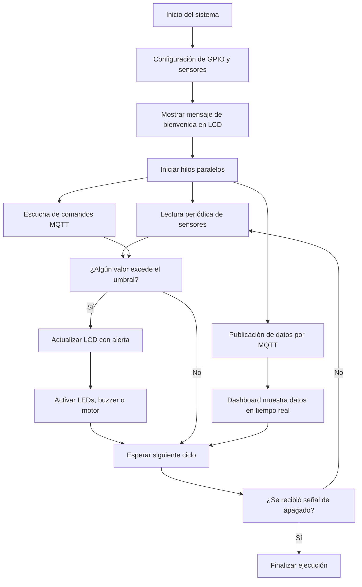

## Carátula
**UNIVERSIDAD DE SAN CARLOS DE GUATEMALA  
FACULTAD DE INGENIERÍA  
ESCUELA DE INGENIERÍA DE CIENCIAS Y SISTEMAS  
LABORATORIO ARQUITECTURA DE COMPUTADORAS Y ENSAMBLADORES 1  
SECCIÓN A
INGENIERO LUIS FERNANDO ESPINO BARRIOS
AUXILIAR DIEGO JOSUE GUEVARA ABAJ**

<ins>**MANUAL TECNICO** </ins>

**GRUPO #2**


| Nombre | Carnet| 
|----------|----------|
| DAMIAN OROZCO   | 202300514 |
| ESTEBAN TRAMPE    | 202300431 |
| JORGE MEJÍA    | 202300376 |
| FATIMA CEREZO    | 202300434 |
| VALERY ALARCÓN    | 202300794 | 

***GUATEMALA 13 DE JUNIO DEL AÑO 2025***

## Introducción

El presente manual técnico documenta el desarrollo, configuración y funcionamiento del prototipo SIEPA (Sistema Inteligente de Evaluación y Predicción Ambiental), un sistema IoT orientado al monitoreo y control ambiental en tiempo real. El sistema fue desarrollado como parte del curso de Arquitectura de Computadores y Ensambladores 1, y está diseñado para operar en espacios físicos como viveros urbanos o jardines automatizados, donde el control de variables ambientales es crucial para el cuidado de plantas sensibles.

SIEPA integra sensores físicos conectados a una Raspberry Pi, comunicación por protocolo MQTT, procesamiento en tiempo real mediante scripts en Python y una interfaz web con acceso restringido que permite visualizar datos históricos, recibir alertas y controlar dispositivos de salida como luces y ventiladores. Este documento está dirigido a desarrolladores, técnicos y futuros mantenedores del sistema, con el objetivo de facilitar su comprensión técnica, replicación o mejora.

## Objetivos 

### 1. General
Desarrollar un sistema IoT inteligente de monitoreo, análisis y control ambiental utilizando una Raspberry Pi y sensores físicos, capaz de recolectar datos en tiempo real, enviarlos a un servidor y permitir su visualización y gestión mediante una interfaz web.

### 2. Específicos
- Diseñar e implementar una red de sensores físicos conectados a una Raspberry Pi para la recolección de datos ambientales (temperatura, humedad, iluminación, presión, calidad del aire y presencia).
- Establecer una comunicación eficiente y en tiempo real entre la Raspberry Pi y un servidor mediante el protocolo MQTT.
- Desarrollar un dashboard web con autenticación, capaz de mostrar datos en tiempo real, generar reportes históricos y activar dispositivos físicos remotamente.
- Visualizar los datos recolectados utilizando una pantalla LCD local y generar alertas visuales y sonoras en caso de detección de valores fuera de rango.


## Descripción del Problema 
En entornos urbanos y agrícolas, el monitoreo ambiental preciso es esencial para garantizar condiciones óptimas que favorezcan el crecimiento de plantas, la conservación de recursos y la sostenibilidad del ecosistema. Sin embargo, muchos espacios como viveros, jardines o cultivos carecen de un sistema automatizado que permita vigilar y controlar en tiempo real variables críticas como la temperatura, la humedad, la iluminación o la calidad del aire.

La supervisión manual de estas condiciones presenta múltiples limitaciones: requiere intervención humana constante, es propensa a errores, y dificulta la toma de decisiones rápidas frente a cambios ambientales repentinos. Además, la ausencia de un sistema de alerta o análisis histórico impide detectar patrones de comportamiento que podrían optimizar el mantenimiento del entorno.

El problema radica, entonces, en la necesidad de contar con una solución tecnológica accesible, automatizada e inteligente que permita:

- Monitorear variables ambientales en tiempo real.
- Detectar condiciones fuera de los rangos ideales.
- Activar respuestas automáticas o remotas según el contexto.
- Ofrecer visualización de datos histórica y actual, tanto localmente como desde una plataforma web segura.

El sistema SIEPA surge como respuesta a esta necesidad, proporcionando una arquitectura modular basada en IoT, capaz de recolectar, transmitir, visualizar y analizar datos ambientales de forma eficiente, contribuyendo así a la automatización y mejora del control ambiental en espacios controlados.


## Requerimientos
Para el desarrollo e implementación del sistema SIEPA, se requiere una combinación de componentes físicos (hardware) y herramientas digitales (software) que permiten la adquisición de datos, procesamiento, visualización y control en tiempo real. A continuación, se detallan los requerimientos necesarios para el funcionamiento completo del sistema.

### Hardware
- **Unidad Central de Procesamiento**
  - Raspberry Pi 4 4GB (modelo con GPIO)
  - Fuente de poder adecuada 5V

- **Sensores Ambientales**
  - Sensor de temperatura y humedad: DHT11
  - Sensor de iluminación: Fotoresistencia (LDR)
  - Sensor de presión barométrica: BMP280
  - Sensor de calidad del aire: MQ135
  - Sensor de movimiento/presencia: HC-SR04

- **Dispositivos de Salida**
  - Pantalla LCD 20x4 con interfaz I2C
  - LEDs de distintos colores (rojo, amarillo, verde, azul)
  - Motor DC o ventilador
  - Buzzer (alerta sonora)
  - Relay de control (para actuadores)

- **Cables y estructura**
  - Jumpers macho-macho y macho-hembra
  - Protoboard o PCB
  - Maqueta estructural (invernadero y sala de control)

- **Otros**
  - Tarjeta microSD (8GB mínimo)
  - Acceso a red Wi-Fi estable


### Software
- **Sistema Operativo**
  - **Ubuntu 20.04+** / **Debian 10+** / **Raspberry Pi OS**

- **Lenguaje de Programación**
  - Python 3.8+
  - Node.js 18+
  - npm o pnpm

- **Broker MQTT**
  - MQTTX (cliente de prueba)
  - Mosquitto (broker local o remoto)

- **Dashboard Web**
  - Lenguaje: HTML, CSS, JavaScript (o framework como Flask o Node.js si se implementa backend)
  - Autenticación básica
  - Gráficas en tiempo real e históricos (ej. Chart.js, Grafana)

- **Otros**
  - Sistema operativo Raspbian o Raspberry Pi OS
  - Visual Studio Code, Thonny o IDE de preferencia
  - Navegador web moderno (para acceso al dashboard)

  
## Librerías Utilizadas

### **Dependencias Core**

#### **paho-mqtt (≥1.6.0)**
- **Descripción:** Cliente MQTT para Python que permite la comunicación bidireccional con brokers MQTT
- **Uso en SIEPA:** 
  - Publicación de datos de sensores al broker Mosquitto
  - Suscripción a comandos desde el frontend
  - Gestión de conexiones MQTT con reconexión automática
- **Archivos que la usan:** `mqtt_manager.py`, `publisher.py`, `subscriber.py`, `monitor_mqtt.py`

### **Dependencias de Hardware (Raspberry Pi)**

#### **RPi.GPIO (≥0.7.0)**
- **Descripción:** Librería para controlar los pines GPIO de Raspberry Pi
- **Uso en SIEPA:**
  - Control del sensor ultrasónico HC-SR04 (trigger y echo)
  - Lectura de fotorresistencia LDR
  - Control del buzzer para alertas
  - Lectura del sensor de calidad del aire MQ135
- **Archivos que la usan:** `sensor_manager.py`

#### **adafruit-circuitpython-dht (≥3.7.0)**
- **Descripción:** Librería de Adafruit para sensores DHT (temperatura y humedad)
- **Uso en SIEPA:**
  - Lectura de temperatura y humedad del sensor DHT11
  - Manejo de errores de lectura del sensor
- **Archivos que la usan:** `sensor_manager.py`
- **Dependencia:** Requiere `adafruit-blinka`

#### **RPLCD (≥1.3.0)**
- **Descripción:** Librería para controlar displays LCD mediante I2C o GPIO
- **Uso en SIEPA:**
  - Mostrar estado del sistema en LCD 20x4
  - Visualizar lecturas de sensores en tiempo real
  - Mostrar alertas y mensajes de estado
- **Archivos que la usan:** `display_manager.py`

#### **adafruit-blinka (≥8.0.0)**
- **Descripción:** Capa de compatibilidad que permite usar librerías CircuitPython en Raspberry Pi
- **Uso en SIEPA:**
  - Base para el funcionamiento de sensores Adafruit
  - Abstracción de hardware para GPIO
- **Dependencia:** Requerida por `adafruit-circuitpython-dht`

### **Dependencias de Desarrollo**

#### **pytest (≥7.0.0)**
- **Descripción:** Framework de testing para Python
- **Uso en SIEPA:**
  - Pruebas unitarias de los managers
  - Pruebas de integración MQTT
  - Validación de funcionalidad del sistema

#### **pytest-cov (≥4.0.0)**
- **Descripción:** Plugin para pytest que genera reportes de cobertura de código
- **Uso en SIEPA:**
  - Análisis de cobertura de pruebas
  - Identificación de código no testeado

#### **loguru (≥0.6.0)**
- **Descripción:** Librería avanzada de logging con formato mejorado
- **Uso en SIEPA:**
  - Logging estructurado del sistema
  - Rotación automática de logs
  - Formato colorido para desarrollo

### **Dependencias de Configuración**

#### **python-dotenv (≥0.19.0)**
- **Descripción:** Carga variables de entorno desde archivos .env
- **Uso en SIEPA:**
  - Configuración de parámetros MQTT
  - Variables de entorno para diferentes modos
  - Gestión de secretos y configuraciones

### **Dependencias Futuras (API REST)**

#### **fastapi (≥0.85.0)**
- **Descripción:** Framework web moderno y rápido para crear APIs REST
- **Uso planificado:**
  - API REST para configuración remota
  - Endpoints para histórico de datos
  - Interfaz web alternativa

#### **uvicorn (≥0.18.0)**
- **Descripción:** Servidor ASGI para aplicaciones FastAPI
- **Uso planificado:**
  - Servidor para la API REST
  - Manejo de WebSockets

### **Dependencias de Base de Datos**

#### **sqlite3**
- **Descripción:** Base de datos embebida (incluida en Python estándar)
- **Uso en SIEPA:**
  - Almacenamiento de histórico de sensores
  - Logs del sistema
  - Configuraciones persistentes

#### **sqlalchemy (≥1.4.0)**
- **Descripción:** ORM (Object-Relational Mapping) para Python
- **Uso planificado:**
  - Abstracción de base de datos
  - Modelos de datos estructurados
  - Migraciones de esquema

### **Librerías Estándar de Python Utilizadas**

#### **time**
- **Uso:** Temporización de lecturas, delays entre mediciones

#### **json**
- **Uso:** Serialización de datos para MQTT, configuración

#### **signal**
- **Uso:** Manejo de señales del sistema (SIGINT, SIGTERM)

#### **sys**
- **Uso:** Argumentos de línea de comandos, gestión del sistema

#### **threading**
- **Uso:** Ejecución concurrente de sensores y MQTT

#### **typing**
- **Uso:** Type hints para mejor documentación del código

#### **argparse**
- **Uso:** Parsing de argumentos de línea de comandos

#### **random**
- **Uso:** Generación de datos simulados en modo testing

#### **datetime**
- **Uso:** Timestamps, formateo de fechas

#### **subprocess**
- **Uso:** Ejecución de comandos del sistema (instalación de Mosquitto)  


## Costo Total

| Item                          | Unidades  |  Precio Unitario | Total |
|-------------------------------|-----------|------------------|--------|
| MD-DHT11 sensor temperatura   | 1         | 27.00            | 27.00  |
| MD-SR04 sensor ultrasonico    | 1         | 24.00            | 24.00  |
| MD-BMP280 sensor presion atm  | 1         | 22.00            | 22.00  |
| MD-MQ135 sensor propano-butano| 1         | 31.00            | 31.00  |
| LCD 20x4                      | 1         | 84.00            | 84.00  |
| LD-5AD LED 5mm amarillo       | 2         | 1.00             | 2.00   |
| LD-5RD LED 5mm rojo           | 2         | 1.00             | 2.00   |
| LD-5AZD LED 5mm azul          | 2         | 1.00             | 2.00   |
| LD-5VD LED 5mm verde          | 2         | 1.00             | 2.00   |
| MT-006 motor DC 1.5-6V        | 1         | 15.00            | 15.00  |
| R-PI44 Raspberry PI 4 B 4Gb   | 1         | 899.00           | 899.00 |
| Cable expansion dupont        | 13        | 4.00             | 52.00  |
| MD-FR060 modulo sensor        | 1         | 16.00            | 16.00  |
| MD-1212 Módulo zumbador buzzer| 1         | 12.00            | 12.00  |
| Case Raspberry                | 1         | 32.00            | 32.00  |
| Convertidor MP                | 1         | 65.00            | 65.00  |
| Carton                        | 2         | 10.00            | 20.00  |
| Papel termoencogible          | 2         | 5.00             | 10.00  |
| Masking                       | 1         | 10.00            | 10.00  |
| Silicon                       | 10        | 1.00             | 10.00  |
| Total                         |           |                  | 1337.00|

## Diagramas 
### Arquitectura del Sistema

```
┌─────────────────┐    MQTT     ┌─────────────────┐    WebSocket    ┌─────────────────┐
│   Sensores IoT  │ ──────────► │   Mosquitto     │ ──────────────► │    Frontend     │
│                 │             │   Broker        │                 │   (Next.js)     │
│ • DHT11         │             │                 │                 │                 │
│ • HC-SR04       │             │ • Puerto 1883   │                 │ • Monitor MQTT  │
│ • LDR           │             │ • Puerto 9001   │                 │ • Dashboard     │
│ • MQ135         │             │   (WebSocket)   │                 │ • Control       │
│ • Buzzer        │             │                 │                 │                 │
└─────────────────┘             └─────────────────┘                 └─────────────────┘
         │                               │
         │                               │
         ▼                               ▼
┌─────────────────┐             ┌─────────────────┐
│  Sistema SIEPA  │◄────────────│  Display LCD    │
│   (Python)      │             │   (20x4 I2C)    │
│                 │             │                 │
│ • SensorManager │             │ • Estado        │
│ • DisplayManager│             │ • Lecturas      │
│ • MQTTManager   │             │ • Alertas       │
└─────────────────┘             └─────────────────┘
```

### Flujo del Programa



## Comunicacion MQTT
### Tópicos MQTT

#### Publicación (Sistema → Frontend)
```
siepa/sensors                    # Datos completos (JSON)
siepa/sensors/temperature        # Temperatura (°C)
siepa/sensors/humidity          # Humedad (%)
siepa/sensors/distance          # Distancia (cm)
siepa/sensors/light             # Luz (true/false)
siepa/sensors/air_quality       # Calidad aire (true=malo)
siepa/actuators/buzzer          # Estado buzzer (JSON)
```

#### Suscripción (Frontend → Sistema)
```
siepa/commands/buzzer           # Control del buzzer
siepa/commands/system           # Comandos del sistema
siepa/commands/sensors/+        # Control de sensores
```

#### Formato de Datos
```json
// siepa/sensors
{
  "temperature": 25.6,
  "humidity": 60.3,
  "distance": 123.45,
  "light": true,
  "air_quality_bad": false,
  "timestamp": 1749175125.395273,
  "mode": "testing",
  "system": "SIEPA"
}

// siepa/actuators/buzzer
{
  "state": true,
  "timestamp": 1749175125.395273,
  "mode": "testing"
}
```


## Backend
El backend del sistema SIEPA está construido en Python y se ejecuta directamente en la Raspberry Pi. Su función principal es gestionar la adquisición de datos desde los sensores, controlar los actuadores (como buzzer, LEDs o ventilador) y manejar la comunicación en tiempo real mediante el protocolo MQTT.

La estructura del backend está organizada en módulos responsables de tareas específicas:

- `sensor_manager.py`: Se encarga de leer los valores de temperatura, humedad, presión, iluminación, presencia y calidad del aire, utilizando las librerías correspondientes para cada tipo de sensor.
- `display_manager.py`: Controla la visualización de datos en la pantalla LCD 20x4, incluyendo información en tiempo real y mensajes de alerta.
- `mqtt_manager.py`: Administra la conexión al broker MQTT (Mosquitto), publica los datos leídos en los tópicos adecuados y escucha comandos desde el dashboard para controlar dispositivos físicos.
- `system.py`: Orquesta la ejecución de los módulos anteriores, lanzando hilos paralelos para lectura de sensores, publicación MQTT y escucha de comandos.
- `main.py`: Es el punto de entrada del sistema y desde donde se inicializa toda la aplicación.

El backend permite operar el sistema tanto en modo de pruebas (simulando datos) como en modo real con los sensores conectados. Además, fue diseñado con modularidad en mente, permitiendo futuras ampliaciones como la integración de una API REST o almacenamiento de datos histórico.

### 1. Estructura del Proyecto Backend
```
backend/
├── config/
│   └── settings.py          # Configuración centralizada
├── core/
│   ├── system.py            # Sistema principal SIEPA
│   ├── sensors/
│   │   └── sensor_manager.py # Gestión de sensores
│   ├── display/
│   │   └── display_manager.py # Gestión del display
│   └── mqtt/
│       └── mqtt_manager.py   # Gestión de MQTT
├── main.py                  # Punto de entrada principal
├── demo_mosquitto.py        # Demostración completa
├── test_mqtt_sensors.py     # Pruebas de integración
├── monitor_mqtt.py          # Monitor de mensajes MQTT
└── requirements.txt         # Dependencias Python
```

## Frontend

El dashboard fue diseñado como una interfaz accesible y segura para administradores del sistema. Permite:

- Autenticación mediante login básico
- Visualización en tiempo real de sensores conectados
- Activación/desactivación de dispositivos remotos (buzzer, ventilador, LEDs)
- Generación de reportes históricos mediante integración con Grafana

El frontend consume datos publicados en los tópicos MQTT y también puede enviar comandos al backend para controlar el estado del sistema.

### 1. Estructura del Proyecto Frontend
```
frontend/
├── app
│   ├── dashboard
│   │   ├── alerts
│   │   │   └── page.tsx
│   │   ├── history
│   │   │   └── page.tsx
│   │   ├── layout.tsx
│   │   └── page.tsx
│   ├── error.tsx
│   ├── layout.tsx
│   ├── login
│   │   └── page.tsx
│   ├── mqtt-sensors
│   │   ├── page.tsx
│   │   └── useMqtt.ts
│   ├── page.tsx
│   └── providers.tsx
├── components
│   ├── atoms
│   │   ├── EmailInput.tsx
│   │   ├── IconWrapperIconify.tsx
│   │   ├── IconWrapper.tsx
│   │   ├── index.ts
│   │   ├── MetricValue.tsx
│   │   ├── PasswordInput.tsx
│   │   ├── PowerToggleButton.tsx
│   │   ├── StatusIndicator.tsx
│   │   └── ThemeToggle.tsx
│   ├── counter.tsx
│   ├── icons.tsx
│   ├── molecules
│   │   ├── AlertItem.tsx
│   │   ├── AlertsDemo.tsx
│   │   ├── AlertsPanel.tsx
│   │   ├── index.ts
│   │   ├── NavigationItem.tsx
│   │   ├── ProgressMeter.tsx
│   │   ├── SensorCard.tsx
│   │   ├── StatusCard.tsx
│   │   └── TestAlertsButton.tsx
│   ├── navbar.tsx
│   ├── organisms
│   │   ├── AlertsPanel.tsx
│   │   ├── DashboardSidebar.tsx
│   │   ├── EnergyConsumptionPanel.tsx
│   │   ├── index.ts
│   │   ├── login-form.tsx
│   │   ├── login-header.tsx
│   │   ├── SensorsGrid.tsx
│   │   └── StatusOverviewGrid.tsx
│   ├── primitives.ts
│   ├── templates
│   │   ├── DashboardLayout.tsx
│   │   ├── index.ts
│   │   └── LoginLayout.tsx
│   └── theme-switch.tsx
├── eslint.config.mjs
├── hooks
│   └── useSystemMonitor.ts
├── lib
│   ├── config
│   │   ├── fonts.ts
│   │   └── site.ts
│   ├── providers
│   │   └── MqttProvider.tsx
│   └── store
│       └── useSystemStore.ts
├── LICENSE
├── next.config.js
├── next-env.d.ts
├── package.json
├── package-lock.json
├── pnpm-lock.yaml
├── postcss.config.js
├── public
│   ├── favicon.ico
│   ├── next.svg
│   └── vercel.svg
├── README.md
├── styles
│   └── globals.css
├── tailwind.config.js
├── test-mqtt-sender.js
├── tsconfig.json
├── types
│   └── index.ts
└── websocket.conf
```

## Modos de Instalación

### **Modo Testing (Desarrollo)**
```bash
pip install paho-mqtt
```
Suficiente para desarrollo y pruebas sin hardware.

### **Modo Real (Raspberry Pi)**
```bash
pip install -r requirements.txt
```
Instala todas las dependencias incluyendo hardware.

### **Instalación Selectiva**
```bash
# Solo MQTT
pip install paho-mqtt

# Solo sensores Raspberry Pi
pip install RPi.GPIO adafruit-circuitpython-dht RPLCD adafruit-blinka

# Solo desarrollo
pip install pytest pytest-cov loguru

# Solo configuración
pip install python-dotenv

# Solo API REST (futuro)
pip install fastapi uvicorn sqlalchemy
```

## Conclusiones 
La Fase 1 del desarrollo del sistema SIEPA representó una experiencia integral de aprendizaje, tanto en aspectos físicos como de programación. Uno de los principales logros fue la integración eficiente de múltiples sensores mediante una Raspberry Pi, logrando recolectar datos ambientales diversos en tiempo real, procesarlos localmente y transmitirlos mediante MQTT hacia un dashboard web funcional y visualmente claro.

Durante el proceso se superaron diversos retos técnicos. Por ejemplo, para obtener datos precisos de sensores como el MQ135 (CO₂) y la fotorresistencia (LDR), fue necesario incorporar un convertidor analógico-digital MCP3008, permitiendo que la Raspberry Pi —que únicamente dispone de entradas digitales— pudiera interpretar valores analógicos, en lugar de limitarse a simples estados booleanos. Esta mejora técnica permitió una lectura cuantitativa mucho más precisa y útil para el monitoreo ambiental.

Asimismo, se identificaron diferencias en los requerimientos eléctricos de los componentes. Mientras que la pantalla LCD requería alimentación de 5V, la mayoría de sensores operaban con 3.3V. Para evitar daños en los dispositivos, se emplearon resistencias estratégicas que permitieran ajustar los niveles de voltaje y asegurar un funcionamiento estable y seguro del sistema.

En cuanto a la capa de software, uno de los desafíos más notables fue la integración del protocolo MQTT con el frontend desarrollado en Next.js, ya que inicialmente se presentaron problemas de rendimiento y manejo de estado. No obstante, tras aplicar técnicas de optimización y desacoplamiento de la lógica, se logró una comunicación fluida y eficiente entre el backend y la interfaz web.

Cada uno de los sensores fue rigurosamente probado para garantizar su correcto funcionamiento:
- El sensor de CO₂ (MQ135) fue expuesto a gases para evaluar su respuesta frente a cambios en la calidad del aire.
- El sensor de iluminación (LDR) fue probado mediante la obstrucción intencional de la luz.
- El sensor de presencia (HC-SR04) fue estimulado con movimiento frente a él.
- El sensor de humedad se evaluó en diferentes ambientes controlados.
- El sensor de temperatura se colocó cerca de fuentes de calor para verificar su sensibilidad.

Esta etapa del proyecto permitió familiarizarnos con sensores que no habíamos utilizado antes, lo cual enriqueció significativamente nuestro conocimiento práctico en electrónica y sistemas embebidos. El trabajo fue desarrollado tanto de manera física como programable, con colaboración remota eficiente entre los miembros del grupo, lo que facilitó el avance paralelo en distintas áreas del sistema.

En conclusión, la Fase 1 sentó una base sólida para el desarrollo posterior de SIEPA. A pesar de las dificultades encontradas, se logró cumplir con los objetivos planteados y se estableció un sistema funcional, escalable y técnicamente robusto.