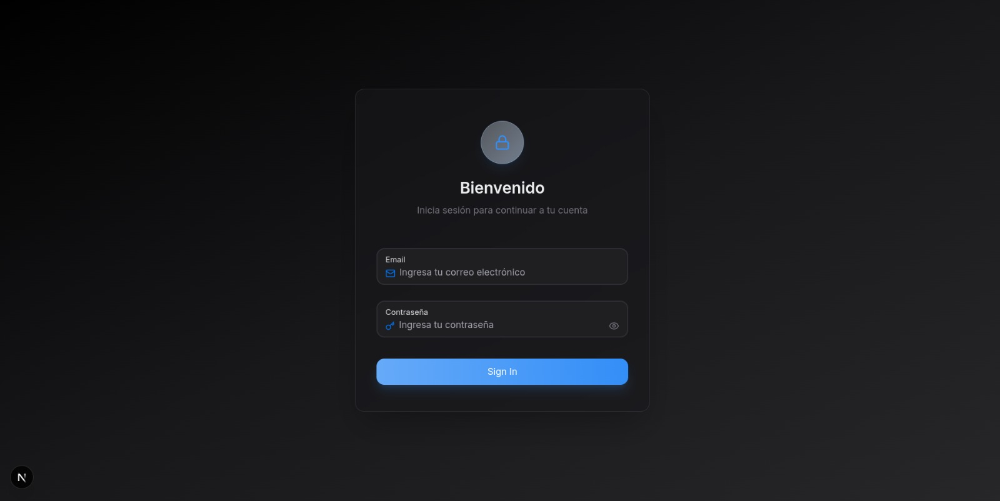
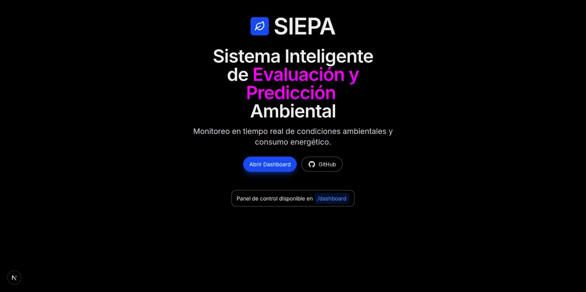
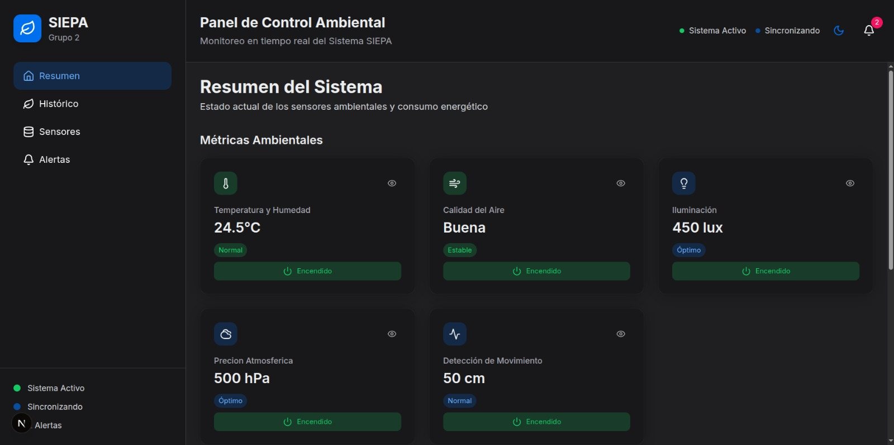
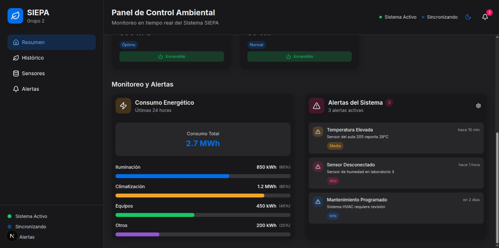
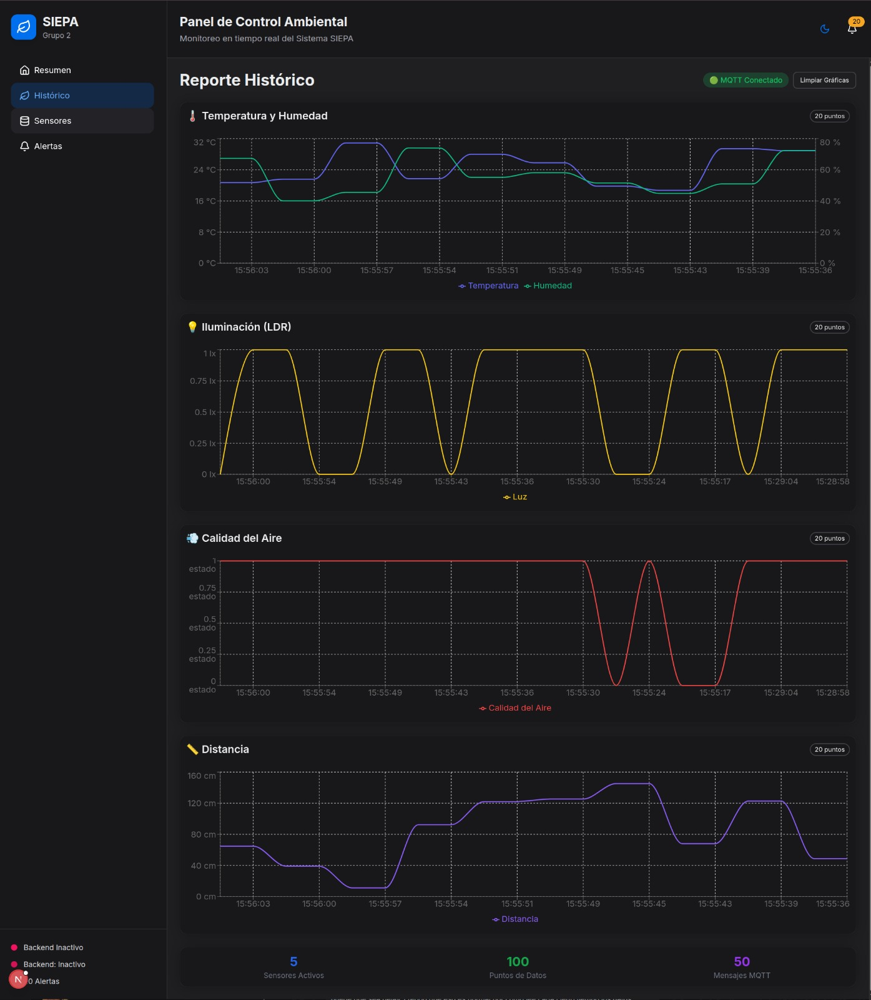
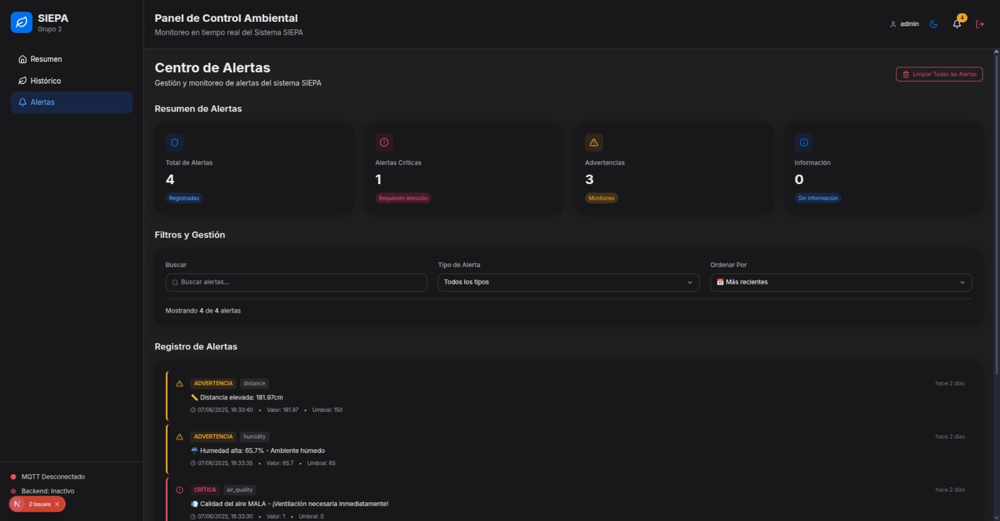
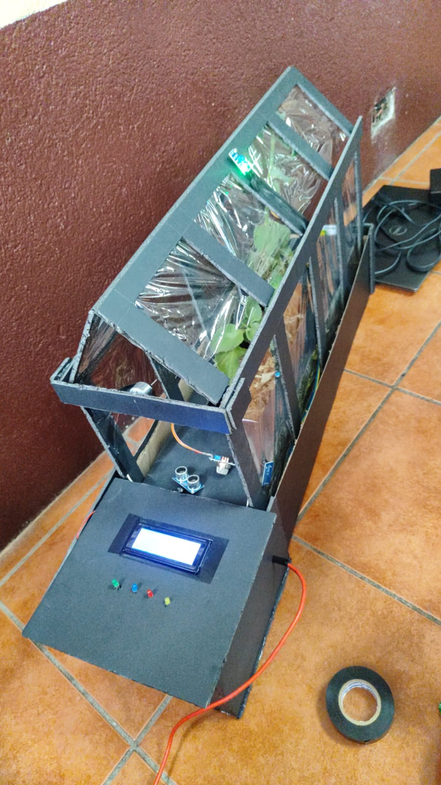
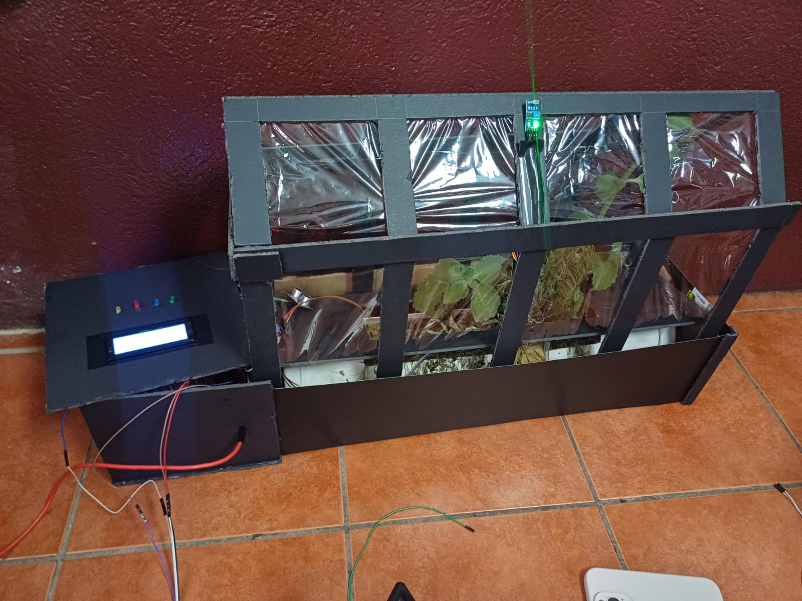
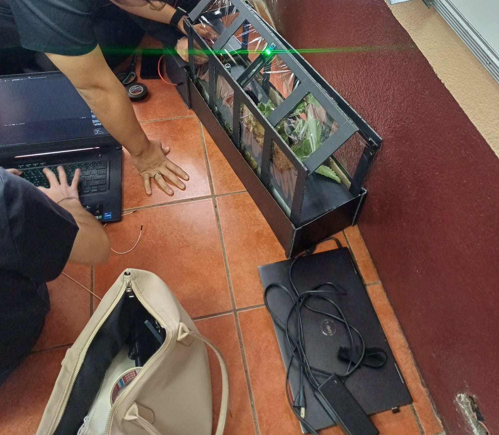

## Carátula
**UNIVERSIDAD DE SAN CARLOS DE GUATEMALA  
FACULTAD DE INGENIERÍA  
ESCUELA DE INGENIERÍA DE CIENCIAS Y SISTEMAS  
LABORATORIO ARQUITECTURA DE COMPUTADORAS Y ENSAMBLADORES 1  
SECCIÓN A
INGENIERO LUIS FERNANDO ESPINO BARRIOS
AUXILIAR DIEGO JOSUE GUEVARA ABAJ**

<ins>**MANUAL USUARIO** </ins>

**GRUPO #2**


| Nombre | Carnet| 
|----------|----------|
| DAMIAN OROZCO   | 202300514 |
| ESTEBAN TRAMPE    | 202300431 |
| JORGE MEJÍA    | 202300376 |
| FATIMA CEREZO    | 202300434 |
| VALERY ALARCÓN    | 202300794 | 

***GUATEMALA 13 DE JUNIO DEL AÑO 2025***

## Introducción
Bienvenido al sistema SIEPA (Sistema Inteligente de Evaluación y Predicción Ambiental), una herramienta tecnológica desarrollada para monitorear en tiempo real las condiciones ambientales de espacios como viveros, jardines o zonas de cultivo.

SIEPA permite visualizar desde una plataforma web los valores actuales de sensores distribuidos en el entorno, incluyendo temperatura, humedad, iluminación, calidad del aire, presencia y presión atmosférica. Además, ofrece funciones de control remoto sobre dispositivos físicos (como ventiladores, luces o alarmas) y genera alertas automáticas cuando se detectan condiciones fuera de los rangos ideales.

Este manual tiene como objetivo guiar al usuario final en el uso correcto del sistema: desde el ingreso al dashboard web, hasta la lectura de reportes históricos, el uso de alertas y el control de dispositivos.

SIEPA está diseñado para ser intuitivo, seguro y eficiente, facilitando así la gestión ambiental sin necesidad de conocimientos técnicos avanzados.

## Objetivos

### Objetivo General
Brindar al usuario final una guía clara y accesible para el uso del sistema SIEPA, facilitando el monitoreo ambiental, la interpretación de alertas y el control remoto de dispositivos conectados mediante una interfaz web intuitiva.

### Objetivos Específicos
- Explicar paso a paso cómo acceder, interpretar y navegar por el dashboard del sistema SIEPA.
- Instruir al usuario sobre el uso adecuado de los controles de actuadores y la gestión de alertas, con base en condiciones ambientales detectadas por los sensores.


## Requisitos de Uso
Para utilizar correctamente el sistema SIEPA y acceder al panel de monitoreo web, el usuario debe contar con los siguientes requerimientos básicos:

### Requisitos de Hardware
- **Dispositivo de acceso**: Puede ser una computadora de escritorio, laptop, tablet o teléfono inteligente.
- **Pantalla**: Resolución mínima recomendada de 1280x720 para una visualización adecuada del dashboard.
- **Conexión a internet**: Se requiere conexión estable para acceder al sistema en línea y visualizar datos en tiempo real.

### Requisitos de Software
- **Navegador web compatible**:
  - Google Chrome (recomendado)
  - Mozilla Firefox
  - Microsoft Edge
  - Safari

- **Acceso a la red local o externa**:
  - En instalaciones locales: el dispositivo debe estar conectado a la misma red que el sistema SIEPA.
  - En instalaciones en línea: se debe proporcionar la dirección pública o IP del servidor.

- **No se necesita instalar software adicional**: El sistema está diseñado para funcionar completamente desde el navegador web, sin requerir instalación de programas externos por parte del usuario.

## Ingreso al Sistema

El acceso al sistema SIEPA se realiza desde un navegador web, a través del Dashboard diseñado para visualizar datos en tiempo real y controlar dispositivos. El sistema cuenta con autenticación básica para garantizar que solo usuarios autorizados puedan ingresar.

### Dirección del Dashboard
Para acceder al Dashboard, abre tu navegador web y escribe la siguiente dirección en la barra de direcciones:  
```http://IP-del-servidor:puerto``` lo que seria para este proyecto http://192.168.1.100:3000

### Pantalla de Login
**Apartado Login**

Al ingresar, se mostrará una pantalla de inicio de sesión con los siguientes campos:

- **Usuario**: admin
- **Contraseña**: admin

Una vez que se ingresen los datos correctamente, se redirige automáticamente al panel principal del sistema.

## Interfaz principal del Dashboard
**Inicio**

Una vez dentro del sistema SIEPA, el usuario tendrá acceso a una interfaz web compuesta por varias pestañas principales. Cada una presenta información específica y herramientas para monitorear o controlar el entorno ambiental del sistema.

### Resumen
**Apartado Resumen**


La pestaña **Resumen** muestra de forma compacta los valores más recientes registrados por los sensores del sistema. Aquí se visualiza el estado actual del ambiente controlado.

**Incluye:**
- Temperatura (°C)
- Humedad relativa (%)
- Nivel de iluminación
- Calidad del aire (buena/mala)
- Presión atmosférica (hPa)
- Detección de presencia (sí/no)

Esta vista está diseñada para ofrecer al usuario una comprensión rápida del estado general del entorno.

---

### Histórico
**Apartado Historico**

En la pestaña **Histórico**, el usuario puede revisar gráficas detalladas con los valores recolectados por los sensores a lo largo del tiempo.

**Incluye:**
- Gráficas por cada sensor (líneas de tiempo)

Esta sección es útil para detectar patrones de comportamiento ambiental, evaluar el rendimiento de los dispositivos, o documentar condiciones críticas en periodos anteriores.

---

### Alertas
**Apartado Alertas**

La pestaña **Alertas** lista todos los eventos críticos detectados por el sistema, en tiempo real y de forma histórica.

**Incluye:**
- Tipo de alerta (temperatura alta, mala calidad del aire, baja iluminación, etc.)
- Fecha y hora del evento
- Filtros para visualizar por medio de tipo o fecha 

Los colores ayudan a identificar rápidamente la gravedad del evento:
- 🔴 Rojo: temperatura crítica
- 🟡 Amarillo: humedad anormal
- 🟢 Verde: iluminación fuera del umbral
- 🔵 Azul: calidad del aire deficiente

Además, si el sistema cuenta con actuadores configurados, las alertas pueden activar automáticamente dispositivos como ventiladores, zumbadores o luces.

### Prototipo  
**MAqueta Fisica**





## Control de actuadores

El sistema SIEPA permite controlar ciertos dispositivos físicos (actuadores) de forma remota desde el Dashboard web. Esto le da al usuario la capacidad de responder ante situaciones ambientales específicas, sin necesidad de intervenir físicamente en el entorno monitoreado.

### Actuadores disponibles
Dependiendo de la configuración del sistema, los siguientes actuadores pueden ser controlados:

- **Ventilador / Motor DC**: Se activa en caso de temperatura elevada.
- **Luz LED adicional**: Se activa si se detecta baja iluminación.
- **Buzzer (alarma sonora)**: Se activa cuando se detecta mala calidad del aire.

### Controles en el Dashboard
En la pestaña de **Resumen** o **Sensores**, el usuario encontrará botones o interruptores (switches) para activar o desactivar los actuadores disponibles.

Ejemplo:
- 🔘 Activar ventilador

Cada acción enviada desde el Dashboard se transmite al sistema mediante MQTT y es procesada por la Raspberry Pi, que enciende o apaga el componente correspondiente.

### Cuándo activar o desactivar un actuador
Aunque el sistema puede actuar automáticamente al detectar condiciones críticas, el usuario también puede intervenir manualmente si lo considera necesario. Algunas situaciones recomendadas:

- **Ventilador**: Puede activarse manualmente si el ambiente está caluroso, incluso si no se ha alcanzado el umbral crítico.

## Ejemplos de uso

A continuación se presentan algunos escenarios comunes en los que el sistema SIEPA entra en funcionamiento. Estos ejemplos ilustran cómo el sistema detecta cambios en el ambiente, genera alertas y activa dispositivos automáticamente o mediante la intervención del usuario.

---

### Escenario 1: Temperatura elevada
**Situación**: Un día caluroso provoca que la temperatura en el invernadero alcance los 34°C.

**Respuesta del sistema**:
- El sensor DHT11 detecta el valor fuera del rango ideal.
- Se genera una alerta visual en el dashboard y en la pantalla LCD.
- El ventilador se activa automáticamente.
- El LED rojo se enciende como indicativo visual de temperatura crítica.

**Acción del usuario**:
- El usuario puede verificar la alerta en la pestaña **Resumen**.
- Si lo desea, puede apagar el ventilador manualmente desde la pestaña de control.

---

### Escenario 2: Iluminación insuficiente
**Situación**: Nubes densas o caída del sol reducen la luz ambiental dentro del vivero.

**Respuesta del sistema**:
- El sensor LDR registra baja iluminación.
- Se muestra una advertencia en el Dashboard y se enciende el LED verde.

**Acción del usuario**:
- Verifica la lectura en tiempo real desde la pestaña **Sensores**.
- Puede forzar el encendido/apagado del sistema de iluminación si lo considera necesario.

---

### Escenario 3: Detección de mala calidad del aire
**Situación**: Se libera gas o humo cerca del sensor MQ135 (CO₂).

**Respuesta del sistema**:
- El sensor detecta niveles elevados de contaminantes.
- Se activa una alerta sonora mediante el buzzer.
- Se muestra una advertencia en el Dashboard y se enciende el LED azul.

**Acción del usuario**:
- Visualiza la alerta desde la pestaña **Alertas**.
- Puede desactivar el buzzer manualmente si la situación ya fue atendida.

---

### Escenario 4: Presencia detectada
**Situación**: Una persona se aproxima al área monitoreada.

**Respuesta del sistema**:
- El sensor ultrasónico HC-SR04 registra movimiento o proximidad.
- Se genera un registro de presencia en el Dashboard (sin activar actuadores).
- Puede utilizarse como sistema de supervisión o seguridad.

---

Estos ejemplos reflejan el comportamiento automatizado del sistema y cómo el usuario puede interactuar con él para monitorear o intervenir según lo requiera el entorno.

## Flujo general del funcionamiento de SIEPA

A continuación se detalla el recorrido completo que siguen los datos dentro del sistema SIEPA, desde su captura hasta su presentación al usuario:

1. **Encendido del sistema**
   - La Raspberry Pi inicia automáticamente al recibir energía.
   - Se inicializan los sensores conectados y la pantalla LCD muestra un mensaje de bienvenida.

2. **Lectura de sensores**
   - Se realiza la lectura periódica de variables ambientales:
     - Temperatura y humedad (DHT11)
     - Iluminación (LDR)
     - Presión (BMP280)
     - Presencia (HC-SR04)
     - Calidad del aire (MQ135)
   - Los datos se recopilan en tiempo real.

3. **Procesamiento local**
   - Los valores son analizados por la Raspberry Pi.
   - Si algún dato está fuera del rango normal, se clasifica como “crítico”.

4. **Activación de alertas locales**
   - Se actualiza el mensaje en la pantalla LCD.
   - Se encienden LEDs de colores según el tipo de alerta.
   - Se activan actuadores como ventilador o buzzer, si corresponde.

5. **Publicación de datos**
   - Los datos recopilados son enviados mediante MQTT al broker Mosquitto.
   - Cada sensor publica su información en un tópico específico.

6. **Recepción de datos por el dashboard**
   - El frontend (Dashboard web) se conecta al broker MQTT.
   - Los datos se reciben y se muestran en tiempo real en la interfaz del usuario.

7. **Interacción desde el Dashboard**
   - El usuario puede observar el estado del ambiente desde la pestaña **Resumen**.
   - Puede consultar gráficas y eventos pasados en **Histórico**.
   - En **Sensores**, puede ver detalles individuales de cada sensor.
   - En **Alertas**, revisa todas las situaciones críticas detectadas.

8. **Control remoto**
   - El usuario puede activar o desactivar actuadores desde el dashboard (luz, ventilador, buzzer).
   - Estas acciones se envían como comandos MQTT de regreso al sistema.

9. **Ciclo continuo**
   - El sistema repite el proceso de lectura, procesamiento y publicación de forma continua.
   - Se mantiene en funcionamiento mientras haya energía o hasta que sea apagado manualmente.
